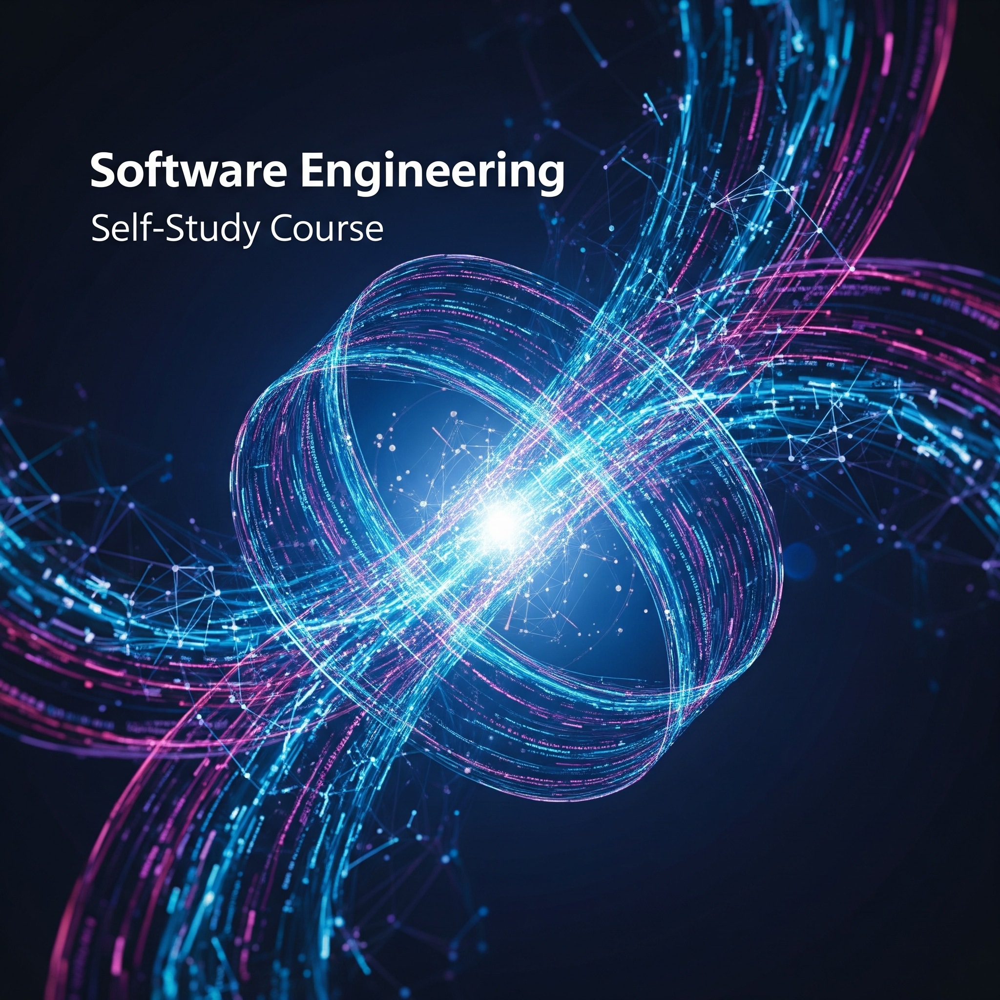

# Mi Viaje de Autoaprendizaje en Ingeniería de Software 🚀




## Introducción

Este documento contiene dos planes de estudio progresivos para aprender Ingeniería de Software de forma autodidacta. Comienza con una base sólida y luego profundiza en temas más avanzados, proporcionando prompts detallados para facilitar la investigación y el aprendizaje con asistentes de IA.

---

## Plan de Estudios Inicial Autodidacta 📚

¡Excelente iniciativa! Aprender ingeniería de software por tu cuenta es un camino desafiante pero muy gratificante. Aquí te propongo un plan de estudios desglosado, con prompts para que puedas profundizar en cada tema usando un chat individual.

**Nota importante:** Este es un camino largo. Sé paciente contigo mismo, practica constantemente y construye proyectos para solidificar tu aprendizaje.

### **Módulo 1: Fundamentos de la Programación y Pensamiento Computacional**

1.  **Introducción a la Programación:**
    * **Temas:** ¿Qué es la programación? ¿Qué es un algoritmo? Tipos de lenguajes de programación (compilados vs. interpretados, tipado fuerte vs. débil). Paradigmas de programación (imperativo, declarativo, orientado a objetos, funcional) a nivel introductorio. Configuración del entorno de desarrollo.
    * **Prompt para profundizar:**
        ```
        Explícame en detalle los conceptos básicos de la programación: qué es un algoritmo, la diferencia entre lenguajes compilados e interpretados, y una introducción a los paradigmas de programación como el imperativo y el orientado a objetos. Recomiéndame un lenguaje para empezar (por ejemplo, Python) y cómo configurar un entorno de desarrollo básico para él.
        ```

2.  **Sintaxis y Elementos Básicos de un Lenguaje (Ej. Python):**
    * **Temas:** Variables, tipos de datos (números, cadenas, booleanos, listas, diccionarios/mapas), operadores (aritméticos, lógicos, de comparación), entrada y salida de datos, comentarios.
    * **Prompt para profundizar:**
        ```
        Usando Python como ejemplo, explícame en detalle las variables, los tipos de datos primitivos y compuestos más comunes (como listas y diccionarios). Detalla los diferentes tipos de operadores y cómo gestionar la entrada y salida de datos por consola.
        ```

3.  **Estructuras de Control:**
    * **Temas:** Condicionales (if, else, elif), bucles (for, while), control de flujo (break, continue, pass).
    * **Prompt para profundizar:**
        ```
        Descríbeme exhaustivamente las estructuras de control en programación, como los condicionales (if/else) y los bucles (for/while). Proporciona ejemplos claros en Python de cómo y cuándo usar cada uno, incluyendo sentencias como break y continue.
        ```

4.  **Funciones y Modularidad:**
    * **Temas:** Definición y llamada de funciones, parámetros y argumentos, valor de retorno, ámbito de las variables (scope), recursividad (introducción).
    * **Prompt para profundizar:**
        ```
        Explícame la importancia de las funciones para la modularidad en el código. Detalla cómo definir y llamar funciones, el paso de parámetros, los valores de retorno y el concepto de ámbito de variables (scope). Incluye una introducción a la recursividad con un ejemplo sencillo.
        ```

5.  **Programación Orientada a Objetos (POO) Básica:**
    * **Temas:** Clases, objetos, atributos, métodos, constructores, encapsulamiento, herencia (básica), polimorfismo (introducción).
    * **Prompt para profundizar:**
        ```
        Introdúceme a los principios fundamentales de la Programación Orientada a Objetos (POO): clases, objetos, atributos y métodos. Explica los conceptos de encapsulamiento y herencia con ejemplos prácticos en Python. ¿Qué es un constructor?
        ```

### **Módulo 2: Estructuras de Datos y Algoritmos (EDyA)**

1.  **Introducción a EDyA y Complejidad Algorítmica:**
    * **Temas:** ¿Por qué son importantes las EDyA? Análisis de eficiencia: Notación Big O (tiempo y espacio).
    * **Prompt para profundizar:**
        ```
        Explícame la importancia de las estructuras de datos y los algoritmos en la eficiencia del software. Introduce el concepto de complejidad algorítmica y la notación Big O, detallando cómo se analiza el rendimiento en tiempo y espacio con ejemplos.
        ```

2.  **Estructuras de Datos Lineales:**
    * **Temas:** Arrays (estáticos y dinámicos), listas enlazadas (simples, dobles, circulares), pilas (stacks), colas (queues), deques. Operaciones comunes, ventajas y desventajas.
    * **Prompt para profundizar:**
        ```
        Describe en detalle las estructuras de datos lineales: arrays, listas enlazadas (simples y dobles), pilas y colas. Para cada una, explica sus operaciones fundamentales (inserción, eliminación, búsqueda), sus ventajas, desventajas y casos de uso comunes. ¿Cómo se implementan conceptualmente?
        ```

3.  **Estructuras de Datos No Lineales:**
    * **Temas:** Árboles (binarios, de búsqueda binaria, AVL, B-Trees - introducción), grafos (dirigidos, no dirigidos, ponderados), tablas hash. Representaciones y recorridos.
    * **Prompt para profundizar:**
        ```
        Explícame las estructuras de datos no lineales fundamentales: árboles (especialmente árboles binarios de búsqueda) y grafos. Describe sus representaciones, algoritmos de recorrido comunes (ej. BFS, DFS para grafos; in-order, pre-order, post-order para árboles) y el funcionamiento básico de las tablas hash.
        ```

4.  **Algoritmos de Ordenamiento y Búsqueda:**
    * **Temas:** Algoritmos de ordenamiento (burbuja, selección, inserción, merge sort, quick sort, heap sort) y sus complejidades. Algoritmos de búsqueda (lineal, binaria).
    * **Prompt para profundizar:**
        ```
        Detalla los principales algoritmos de ordenamiento (como burbuja, inserción, merge sort y quick sort) y búsqueda (lineal y binaria). Para cada uno, explica su lógica de funcionamiento, su complejidad temporal (Big O) en el peor, mejor y caso promedio, y cuándo es más adecuado usar uno u otro.
        ```

### **Módulo 3: Herramientas y Prácticas Esenciales del Desarrollador**

1.  **Control de Versiones con Git y GitHub/GitLab:**
    * **Temas:** ¿Qué es el control de versiones? Repositorios, commits, ramas (branching), fusiones (merging), resolución de conflictos, pull requests, flujos de trabajo básicos (Git Flow introductorio).
    * **Prompt para profundizar:**
        ```
        Necesito aprender a usar Git y GitHub (o GitLab) para el control de versiones. Explícame los conceptos clave como repositorios, commits, ramas (branching), fusiones (merging) y pull requests. ¿Cuáles son los comandos básicos más importantes y un flujo de trabajo típico para colaborar en un proyecto?
        ```

2.  **Línea de Comandos (Terminal/Shell):**
    * **Temas:** Navegación, manipulación de archivos y directorios, permisos, pipes, scripts básicos.
    * **Prompt para profundizar:**
        ```
        Explícame los comandos básicos esenciales de la línea de comandos (Bash/Shell) para un desarrollador de software. Cubre navegación por directorios, creación/eliminación/copia/movimiento de archivos y carpetas, gestión de permisos y el uso de pipes.
        ```

3.  **Entornos de Desarrollo Integrado (IDEs) y Editores de Código:**
    * **Temas:** Funcionalidades principales (autocompletado, depuración, refactorización). Ejemplos: VS Code, IntelliJ IDEA, PyCharm, Eclipse. Extensiones útiles.
    * **Prompt para profundizar:**
        ```
        Háblame sobre los Entornos de Desarrollo Integrado (IDEs) y editores de código avanzados. ¿Cuáles son las ventajas de usar un IDE como VS Code o IntelliJ IDEA frente a un editor simple? Explica funcionalidades clave como la depuración (debugging), el autocompletado inteligente y las herramientas de refactorización.
        ```

4.  **Depuración (Debugging):**
    * **Temas:** Técnicas de depuración, uso de depuradores (breakpoints, step over, step into, step out), lectura de trazas de error (stack traces).
    * **Prompt para profundizar:**
        ```
        Explícame las técnicas y herramientas fundamentales para la depuración de software. ¿Cómo se utiliza un depurador, qué son los breakpoints, y cómo interpretar las trazas de error (stack traces) para encontrar y solucionar bugs eficazmente?
        ```

### **Módulo 4: Desarrollo Backend**

1.  **Introducción al Desarrollo Backend:**
    * **Temas:** ¿Qué es el backend? Responsabilidades. Arquitectura cliente-servidor. Protocolo HTTP (requests, responses, métodos, códigos de estado). APIs y servicios web.
    * **Prompt para profundizar:**
        ```
        Introdúceme al mundo del desarrollo backend. Explica qué es una API, el protocolo HTTP (métodos, códigos de estado, cabeceras), y la arquitectura cliente-servidor. ¿Cuáles son las responsabilidades típicas de un desarrollador backend?
        ```

2.  **Bases de Datos:**
    * **Temas:**
        * **Bases de Datos Relacionales (SQL):** Modelado de datos (entidad-relación), SQL (SELECT, INSERT, UPDATE, DELETE, JOINs), claves primarias y foráneas, normalización (básica). Ejemplos: PostgreSQL, MySQL.
        * **Bases de Datos NoSQL (Introducción):** Tipos (documentales, clave-valor, columnares, grafos). Casos de uso. Ejemplos: MongoDB, Redis.
    * **Prompt para profundizar (SQL):**
        ```
        Explícame los fundamentos de las bases de datos relacionales y el lenguaje SQL. Detalla cómo modelar datos (diagramas entidad-relación), las sentencias SQL principales (CRUD, JOINs), y los conceptos de claves primarias/foráneas y normalización básica. ¿Qué es un ORM y para qué sirve?
        ```
    * **Prompt para profundizar (NoSQL):**
        ```
        Introdúceme a las bases de datos NoSQL. Describe los principales tipos (documentales, clave-valor, etc.), sus diferencias con las SQL, ventajas, desventajas y casos de uso comunes para cada tipo. Menciona ejemplos populares como MongoDB.
        ```

3.  **Frameworks Backend (Elegir uno para empezar, ej. Django/Flask con Python, Node.js con Express, Spring con Java):**
    * **Temas:** Rutas, controladores/vistas, plantillas (si aplica), manejo de peticiones y respuestas, middleware, interacción con bases de datos (ORMs/ODMs).
    * **Prompt para profundizar (ej. con Node.js y Express):**
        ```
        Quiero aprender a construir APIs RESTful con Node.js y el framework Express. Explícame cómo definir rutas, manejar peticiones HTTP (GET, POST, PUT, DELETE), interactuar con una base de datos (ej. MongoDB con Mongoose), y gestionar middlewares. Proporciona un ejemplo de una API CRUD básica.
        ```

4.  **Autenticación y Autorización:**
    * **Temas:** Conceptos. Sesiones, tokens (JWT), OAuth (introducción). Hashing de contraseñas.
    * **Prompt para profundizar:**
        ```
        Explícame los conceptos de autenticación y autorización en aplicaciones web. Describe diferentes mecanismos como sesiones y cookies, JSON Web Tokens (JWT), y una introducción a OAuth2. ¿Cuáles son las mejores prácticas para el manejo seguro de contraseñas?
        ```

### **Módulo 5: Desarrollo Frontend (Básico/Intermedio)**

1.  **HTML (HyperText Markup Language):**
    * **Temas:** Estructura de un documento HTML, etiquetas semánticas (header, nav, main, article, section, footer), formularios, tablas, multimedia.
    * **Prompt para profundizar:**
        ```
        Explícame la estructura de un documento HTML5 y la importancia de las etiquetas semánticas. Detalla cómo crear formularios, tablas e incrustar contenido multimedia. ¿Qué es el DOM?
        ```

2.  **CSS (Cascading Style Sheets):**
    * **Temas:** Selectores, propiedades, modelo de caja (box model), Flexbox, CSS Grid, diseño responsivo (media queries), pseudoclases y pseudoelementos. Preprocesadores (Sass/LESS - introducción).
    * **Prompt para profundizar:**
        ```
        Enséñame los fundamentos de CSS para estilizar páginas web. Explica los selectores, el modelo de caja, y cómo funcionan Flexbox y CSS Grid para el layout. ¿Cómo creo diseños responsivos usando media queries? Introduce brevemente los preprocesadores CSS.
        ```

3.  **JavaScript (en el Navegador):**
    * **Temas:** Manipulación del DOM, eventos, AJAX (Fetch API, XMLHttpRequest), JSON, almacenamiento web (localStorage, sessionStorage), ES6+ (arrow functions, let/const, promesas, async/await).
    * **Prompt para profundizar:**
        ```
        Explícame cómo usar JavaScript en el navegador para crear interactividad. Detalla la manipulación del DOM, el manejo de eventos, cómo realizar peticiones asíncronas con Fetch API (AJAX) para consumir APIs, y las características modernas de ES6+ como promesas y async/await.
        ```

4.  **Frameworks/Librerías Frontend (Elegir uno, ej. React, Vue, Angular - Introducción):**
    * **Temas:** Componentes, estado, propiedades (props), ciclo de vida (básico), enrutamiento (básico).
    * **Prompt para profundizar (ej. con React):**
        ```
        Introdúceme al desarrollo frontend con React. Explica el concepto de componentes, cómo manejar el estado y las propiedades (props), el Virtual DOM, y JSX. ¿Cómo se gestiona el ciclo de vida básico de un componente y el enrutamiento simple?
        ```

### **Módulo 6: Metodologías y Principios de Ingeniería de Software**

1.  **Metodologías de Desarrollo:**
    * **Temas:** Cascada (Waterfall), Agile (Scrum, Kanban). Principios Agile. Roles en Scrum.
    * **Prompt para profundizar:**
        ```
        Explícame las diferencias fundamentales entre la metodología Waterfall y las metodologías Agile (como Scrum y Kanban). Detalla los principios del manifiesto Agile, los roles, eventos y artefactos de Scrum.
        ```

2.  **Principios de Diseño de Software (SOLID, DRY, KISS, YAGNI):**
    * **Temas:** Significado y aplicación de cada principio.
    * **Prompt para profundizar:**
        ```
        Descríbeme los principios de diseño de software SOLID, DRY, KISS y YAGNI. Para cada uno, explica su significado, por qué es importante y proporciona un ejemplo práctico de cómo aplicarlo en el código.
        ```

3.  **Pruebas de Software (Testing):**
    * **Temas:** Importancia del testing. Tipos de pruebas: unitarias, de integración, funcionales/E2E. Pirámide de testing. TDD (Test-Driven Development) y BDD (Behavior-Driven Development) - introducción. Herramientas comunes (ej. Jest, PyTest, JUnit, Selenium).
    * **Prompt para profundizar:**
        ```
        Explícame la importancia de las pruebas de software. Describe los diferentes niveles de la pirámide de testing (pruebas unitarias, de integración, E2E). Introduce los conceptos de TDD y BDD. ¿Qué herramientas son comunes para cada tipo de prueba en un stack tecnológico específico (ej. JavaScript o Python)?
        ```

4.  **Patrones de Diseño (Introducción):**
    * **Temas:** ¿Qué son? ¿Por qué usarlos? Ejemplos de patrones comunes (ej. Singleton, Factory, Observer, Decorator, MVC/MVP/MVVM).
    * **Prompt para profundizar:**
        ```
        Introdúceme a los patrones de diseño de software. Explica qué son, por qué son útiles, y describe algunos patrones creacionales (ej. Factory, Singleton), estructurales (ej. Decorator, Adapter) y de comportamiento (ej. Observer, Strategy) con ejemplos de cuándo podrían aplicarse.
        ```

### **Módulo 7: Temas Avanzados y Especialización (Introducción)**

1.  **Arquitectura de Software:**
    * **Temas:** Monolitos, microservicios, arquitecturas orientadas a eventos, serverless. Consideraciones (escalabilidad, mantenibilidad, coste).
    * **Prompt para profundizar:**
        ```
        Explícame los diferentes estilos arquitectónicos de software como monolitos, microservicios y arquitecturas orientadas a eventos (EDA). Compara sus ventajas, desventajas y cuándo es apropiado elegir cada uno. ¿Qué implica una arquitectura serverless?
        ```

2.  **DevOps y CI/CD:**
    * **Temas:** Cultura DevOps. Integración Continua (CI), Entrega Continua (CD), Despliegue Continuo (CD). Pipelines. Contenedores (Docker - básico), Orquestación (Kubernetes - muy básico).
    * **Prompt para profundizar:**
        ```
        Introdúceme a la cultura DevOps y los conceptos de CI/CD (Integración Continua, Entrega Continua y Despliegue Continuo). Explica qué es un pipeline de CI/CD y el papel de herramientas como Docker para la contenerización. Menciona brevemente qué es Kubernetes.
        ```

3.  **Seguridad en el Software (SecDevOps):**
    * **Temas:** Principios básicos de seguridad. OWASP Top 10. Inyección SQL, XSS, CSRF. Prácticas de codificación segura.
    * **Prompt para profundizar:**
        ```
        Explícame los principios fundamentales de la seguridad en el desarrollo de software (SecDevOps). Describe algunas de las vulnerabilidades más comunes del OWASP Top 10 (como Inyección SQL, XSS) y las buenas prácticas para prevenir estos ataques durante el desarrollo.
        ```

4.  **Cloud Computing (Introducción):**
    * **Temas:** Modelos de servicio (IaaS, PaaS, SaaS). Principales proveedores (AWS, Azure, GCP). Servicios comunes (cómputo, almacenamiento, bases de datos).
    * **Prompt para profundizar:**
        ```
        Introdúceme a los conceptos básicos de la computación en la nube (Cloud Computing). Explica los modelos de servicio IaaS, PaaS y SaaS, y menciona los principales proveedores como AWS, Azure y GCP, junto con algunos de sus servicios fundamentales para desarrolladores.
        ```

---